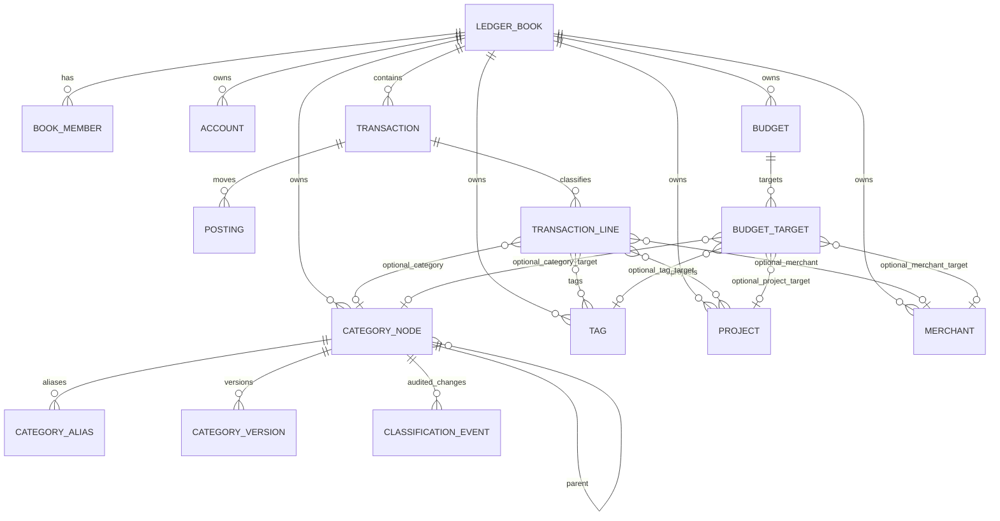

# Domain Redesign: Books, Classification, and Reporting

This document redesigns the Track Anywhere backend domain model for a
backend-first "随手记" style product. It is a design target, not the current
implementation.

## Why Redesign

The current first slice models a single global ledger with categories stored as
`primary` and `secondary` strings on one category record. That is enough for
early capture, but it breaks down once the product needs:

- multiple ledgers such as personal, family, travel, reimbursement, and business
  books
- first-level category management, metadata, icon, color, sort order, and budget
  policy
- duplicate prevention across aliases and spelling variants
- reports across category, merchant, project, tag, account, payment channel, and
  necessity dimensions
- stable historical semantics when categories are renamed, moved, merged, or
  deleted

The redesign separates money movement from analytical classification. The
confirmed ledger remains strict and posting-based. Reporting dimensions become
first-class entities.

## Design Principles

1. A book is the primary namespace.
   Accounts, transactions, categories, tags, projects, merchants, rules, budgets,
   and audit records belong to a `ledger_book`.

2. Postings explain where money moved.
   Postings should not carry UI/reporting concepts beyond account and currency.

3. Transaction lines explain what the money was for.
   A single transaction can have one or many classified lines. Lines carry
   category, merchant, project, tag, reimbursement, and necessity metadata.

4. Categories are a managed tree, not two string columns.
   First-level categories are real nodes with metadata and lifecycle. Child
   categories reference their parent. The product starts with two independent
   two-level category trees: one for expenses and one for income.

5. Tags and projects are not categories.
   Categories answer "what kind of spend/income is this?" Tags and projects
   answer cross-cutting questions such as "which trip?", "is it reimbursable?",
   "which client?", or "was it necessary?".

6. Budgets are targets, not categories.
   Budgets can target a whole book, a category subtree, a project, a tag, or a
   merchant over a time period. Category nodes can expose display metadata, but
   budget amounts live in budget target records.

7. Historical reports must be explicit.
   A report can ask for current taxonomy or the taxonomy recorded on each line,
   but the default should not silently rewrite the past after category
   maintenance.

## Proposed Domain Model



### `ledger_books`

The book is the product boundary.

Core fields:

- `book_id`
- `name`
- `kind`: `personal`, `family`, `travel`, `business`, `reimbursement`, `custom`
- `base_currency`
- `timezone`
- `status`: `active`, `archived`
- `template_key`
- `settings_json`
- `created_by`
- timestamps and version

Rules:

- Every non-global user object references `book_id`.
- Cross-book references are invalid unless a future explicit sharing mechanism
  introduces them.
- Reports default to one book. Multi-book reports should be a separate query
  mode.

### `book_members`

Supports future shared books without redesigning permissions later.

Core fields:

- `book_id`
- `user_id`
- `role`: `owner`, `admin`, `editor`, `viewer`, `auditor`
- `scopes_json`
- `status`

Rules:

- Current single-user behavior can create one owner membership automatically.
- Auth scopes must be checked against both token and book membership.

### `accounts`

Accounts become book-scoped. The existing ledger account model largely survives,
with `book_id` added.

Rules:

- One account belongs to one book.
- Account balances are derived only from postings in the same book.
- Transfers between books should be modeled as two book-local transactions plus
  an optional cross-book link, not as one transaction that violates isolation.

### `transactions`

Transactions remain confirmed ledger events.

Core fields:

- `transaction_id`
- `book_id`
- `occurred_at`
- `effective_date`
- `timezone`
- `memo`
- `source`: `manual`, `cli`, `ocr`, `import`, `recurring`, `agent`
- `external_ref`
- `reversed_by`
- `version`

Rules:

- A transaction has postings for accounting correctness.
- A transaction has lines for reporting correctness.
- A simple consumer-facing expense command still expands into balanced postings
  and one classified line.
- Reversal remains append-only: do not mutate or delete confirmed postings.

### `postings`

Postings use the canonical debit/credit model.

Core fields:

- `posting_id`
- `transaction_id`
- `position`
- `account_id`
- `side`: `debit` or `credit`
- `amount`
- `currency`
- `amount_semantics`: `debit_credit` for new rows; `legacy_signed` only for
  historical migration/audit rows

Rules:

- Posting accounts must belong to the same book as the transaction.
- New postings must use explicit `side` plus positive `amount`; signed posting
  amounts are not a runtime representation.
- Posted transactions balance when debit totals equal credit totals by currency.
- Reports about balances use postings.
- Reports about spending purpose use transaction lines.

### `transaction_lines`

Transaction lines are the analysis unit.

Core fields:

- `line_id`
- `transaction_id`
- `line_type`: `expense`, `income`, `transfer_fee`, `refund`, `adjustment`
- `amount`
- `currency`
- `category_id`
- `category_version_id`
- `category_path_snapshot_json`
- `merchant_id`
- `project_id`
- `necessity`: `essential`, `discretionary`, `investment`, `unknown`
- `reimbursement_status`: `none`, `claimable`, `claimed`, `reimbursed`
- `memo`

Rules:

- A simple expense creates one line.
- `line_type=expense` lines may reference only `expense` categories.
- `line_type=income` lines may reference only `income` categories.
- `line_type=transfer_fee` is classified as an expense line for reports, but
  remains distinct from the transfer's cash movement.
- `line_type=refund` should link back to the original expense when possible and
  declare whether reports should net it against the original category.
- `line_type=adjustment` and pure transfers do not require user categories.
- A receipt split across food and delivery fee creates multiple lines.
- A transfer normally has no expense/income line unless it includes a fee.
- Reports by category, tag, project, merchant, and necessity use lines.

### `category_nodes`

Categories are a tree.

Core fields:

- `category_id`
- `book_id`
- `kind`: `expense`, `income`
- `parent_id`
- `name`
- `normalized_name`
- `level`: `1` or `2`
- `path_cache`
- `icon`
- `color`
- `sort_order`
- `status`: `active`, `hidden`, `archived`
- `version`

Rules:

- Each book has two independent category trees: one for `expense` and one for
  `income`.
- First-level income categories and first-level expense categories are separate
  nodes, even when their display names are the same.
- User categories do not include transfer or system categories. Transfers,
  balance adjustments, fees, and reversals are transaction/line roles.
- `kind` is immutable after creation. Moving a node between income and expense is
  a reclassification/merge operation, not an in-place update.
- Unique active node: `(book_id, kind, parent_id, normalized_name)`.
- A first-level category is `parent_id is null`.
- A second-level category references a first-level parent of the same `kind`.
- The initial product limit is exactly two levels. If future requirements need
  deeper trees, add a separate migration and report compatibility plan instead
  of relying on unused depth today.
- First-level nodes are manageable entities. Rename, icon/color changes, sort
  order, hide/archive, aliasing, and budget targeting operate on that node ID.
- Category nodes can store display metadata such as icon, color, and sort order,
  but should not store budget amounts. Budgets reference categories through
  budget targets.
- Deleting a used category should hide/archive or require an explicit migration
  target.

Expense examples:

- `餐饮`
- `餐饮 / 外卖`
- `餐饮 / 堂食`
- `交通 / 打车`

Income examples:

- `工资`
- `工资 / 主业`
- `工资 / 副业`
- `投资收入 / 利息`
- `投资收入 / 分红`

### `category_aliases`

Aliases prevent duplicate concepts from being created by OCR/import/AI.

Core fields:

- `alias_id`
- `book_id`
- `category_id`
- `alias`
- `normalized_alias`
- `locale`
- `source`: `manual`, `import`, `ai`, `migration`
- `confidence`
- `status`

Rules:

- `食品` can alias to `餐饮`.
- `外賣` can alias to `外卖`.
- Import and AI classification must resolve aliases before creating categories.
- Alias collisions should be explicit conflicts, not silent auto-merges.

### `category_versions`

Versions preserve historical meaning.

Core fields:

- `category_version_id`
- `category_id`
- `book_id`
- `name`
- `parent_id`
- `path`
- `icon`
- `color`
- `valid_from`
- `valid_to`
- `change_reason`

Rules:

- Transaction lines reference the category version active when the line was
  classified.
- A report can use either:
  - as-recorded taxonomy: line version/path at the transaction date
  - current taxonomy: current category node tree
- Structural changes create new versions.

### `classification_events`

Category maintenance is auditable and reversible where practical.

Core fields:

- `classification_event_id`
- `book_id`
- `event_type`: `rename`, `move`, `merge`, `archive`, `restore`, `alias_add`,
  `alias_remove`, `historical_reassign`
- `source_category_id`
- `target_category_id`
- `affected_line_count`
- `before_json`
- `after_json`
- `rollback_json`
- `created_by`
- `created_at`

Rules:

- Rename, move, merge, and historical reassignment create events.
- Merge records source, target, aliases created, affected line count, and
  rollback metadata.
- Bulk historical reassignment is an explicit command, not a side effect of
  editing the current taxonomy.
- Event data is part of the audit model and should not be treated as UI-only
  change history.

### `tags`

Tags are many-to-many labels for flexible grouping.

Core fields:

- `tag_id`
- `book_id`
- `name`
- `normalized_name`
- `color`
- `tag_type`: `general`, `need`, `reimbursement`, `lifestyle`, `source`
- `status`

Rules:

- A line can have multiple tags.
- Tags should not replace categories.
- Use tags for temporary or cross-cutting concerns.

Examples:

- `旅行-东京2026`
- `可报销`
- `必要消费`
- `冲动消费`

### `projects`

Projects are structured events/goals.

Core fields:

- `project_id`
- `book_id`
- `name`
- `kind`: `trip`, `home_renovation`, `client`, `reimbursement`, `goal`, `custom`
- `starts_on`
- `ends_on`
- `status`
- `budget_amount`
- `currency`
- `metadata_json`

Rules:

- Use projects when the dimension has lifecycle, budget, members, or reporting
  requirements.
- Use tags when the dimension is lightweight and ad hoc.

### `merchants` / `payees`

Merchants normalize counterparty names from payments and imports.

Core fields:

- `merchant_id`
- `book_id`
- `display_name`
- `normalized_name`
- `merchant_type`
- `default_category_id`
- `default_tags_json`
- `status`

Supporting table:

- `merchant_aliases`: raw names, payment platform names, OCR variants

Rules:

- `幸福源爆炒螺蛳粉` and platform-specific raw names can resolve to one merchant.
- Merchant defaults can suggest categories but should not silently override user
  choices without a rule or confirmation policy.

### `budgets`

Budgets target dimensions over periods.

Core fields:

- `budget_id`
- `book_id`
- `name`
- `period`: `monthly`, `weekly`, `yearly`, `custom`
- `starts_on`
- `ends_on`
- `currency`
- `total_amount`
- `rollover_policy`: `none`, `carry_remaining`, `carry_overspend`
- `alert_thresholds_json`
- `status`

### `budget_targets`

Budget targets define what a budget applies to.

Core fields:

- `budget_target_id`
- `budget_id`
- `target_type`: `book`, `category_node`, `category_subtree`, `project`, `tag`,
  `merchant`, `custom_query`
- `target_id`
- `mode`: `include`, `exclude`
- `amount`
- `metadata_json`

Rules:

- A total monthly spend budget is `target_type=book`.
- A food budget is `target_type=category_subtree` targeting `餐饮`.
- A Tokyo trip budget is `target_type=project`.
- A "non-essential spend" budget can include a tag such as `非必要消费`.
- A budget can exclude a tag, for example excluding `可报销` from personal
  monthly spend.
- Category budgets are budget target records, not fields on category nodes.

### `classification_rules`

Rules make import/OCR/agent flows deterministic.

Core fields:

- `rule_id`
- `book_id`
- `priority`
- `enabled`
- `match_json`: merchant, memo, amount range, account, platform, currency
- `action_json`: category, merchant, tags, project, necessity
- `created_by`
- `last_applied_at`

Rules:

- Rules should be dry-runnable.
- Rule application should record an audit event or classification provenance.
- Manual user correction can propose a rule, but rule creation should be
  explicit.

## Historical Semantics

Category maintenance needs explicit modes.

### Rename

Use when the concept is the same but the display name changes.

Example: `餐饮` -> `吃饭餐饮`.

Behavior:

- update current `category_nodes.name`
- create `category_versions` row
- create a `classification_events` row
- as-recorded reports can still show old path if requested
- current reports show the new name

### Move

Use when the category changes parent.

Example: `食品 / 外卖` -> `餐饮 / 外卖`.

Behavior:

- create a new category version for future/current taxonomy
- create a `classification_events` row
- existing lines keep `category_version_id` and snapshot
- reports choose as-recorded or current taxonomy explicitly

### Merge

Use when two categories represent the same concept.

Example: `食品 / 外卖` and `餐饮 / 外卖`.

Behavior:

- mark source category as merged/archived
- add aliases from source names to target
- optionally run an explicit historical reassignment command
- record audit event with source, target, affected transaction count, and
  rollback metadata

### Delete

Deleting used categories should not physically delete by default.

Behavior:

- unused category: hard delete is acceptable
- used category: hide/archive, or require migration target
- category archive creates a `classification_events` row
- hard deletion requires explicit irreversible operation

## Reporting Model

Reports should group `transaction_lines`, not raw transactions.

Useful grouping dimensions:

- `book`
- `account`
- `category`
- `category_parent`
- `category_subtree`
- `tag`
- `project`
- `merchant`
- `payment_account`
- `necessity`
- `reimbursement_status`
- `source`
- `currency`

Report controls:

- `taxonomy_mode=as_recorded|current`
- `date_basis=occurred_at|effective_date`
- `include_reversed=false` by default
- `currency_mode=native|book_base`
- `book_ids` explicit for multi-book reports

Example API shape:

```text
GET /api/v1/books/{book_id}/reports/spending
  ?from=2026-05-01
  &to=2026-05-31
  &group_by=category_parent
  &taxonomy_mode=as_recorded
  &currency=CNY
```

## API Shape

Prefer book-scoped routes for new APIs:

```text
GET    /api/v1/books
POST   /api/v1/books
GET    /api/v1/books/{book_id}
PATCH  /api/v1/books/{book_id}

GET    /api/v1/books/{book_id}/accounts
POST   /api/v1/books/{book_id}/accounts

GET    /api/v1/books/{book_id}/transactions
POST   /api/v1/books/{book_id}/transactions
POST   /api/v1/books/{book_id}/transactions/{transaction_id}/reverse

GET    /api/v1/books/{book_id}/categories
POST   /api/v1/books/{book_id}/categories
PATCH  /api/v1/books/{book_id}/categories/{category_id}
POST   /api/v1/books/{book_id}/categories/{category_id}/aliases
POST   /api/v1/books/{book_id}/categories/{category_id}/merge
GET    /api/v1/books/{book_id}/classification-events

GET    /api/v1/books/{book_id}/tags
GET    /api/v1/books/{book_id}/projects
GET    /api/v1/books/{book_id}/merchants
GET    /api/v1/books/{book_id}/budgets
POST   /api/v1/books/{book_id}/budgets
POST   /api/v1/books/{book_id}/budgets/{budget_id}/targets
GET    /api/v1/books/{book_id}/reports/spending
```

Compatibility can keep existing `/api/v1/accounts`, `/api/v1/expenses`, and
`/api/v1/summary/categories` as wrappers around the default book during
migration.

## Migration Strategy

### Phase 1: Introduce Books

- Create `ledger_books` and `book_members`.
- Create one default personal book for existing data.
- Add `book_id` to accounts, transactions, categories, drafts, recurring items,
  funds, investments, credentials/audit references where needed.
- Keep current API behavior by resolving the default book when no book is
  supplied.

Tests:

- existing tests still pass with default book
- two books cannot see each other's accounts or transactions
- auth checks include book membership

### Phase 2: Introduce Category Tree

- Create `category_nodes`, `category_aliases`, `category_versions`, and
  `classification_events`.
- Migrate each existing category:
  - `kind` selects the target tree: income categories migrate into the income
    tree; expense categories migrate into the expense tree
  - `primary` becomes or reuses a first-level node within that `kind`
  - `secondary` becomes a child node under that first-level node
  - no secondary means the first-level node is also selectable
- Keep a legacy mapping from old category IDs to new node IDs until callers are
  migrated.

Tests:

- `食品 / 外卖` creates one parent and one child
- `工资 / 主业` creates income nodes and cannot be used on an expense line
- `餐饮 / 外卖` creates expense nodes and cannot be used on an income line
- `expense:餐饮` and `income:餐饮` are allowed as separate first-level nodes
- creating a third-level category fails
- transfer/system roles are not returned as user category trees
- duplicate aliases do not create duplicate nodes
- category list can return tree and flat views
- category rename/move/merge creates classification events

### Phase 3: Introduce Transaction Lines

- Create one transaction line for each existing categorized transaction.
- Derive amount from the existing expense/income posting logic.
- Store `category_id`, `category_version_id`, and `category_path_snapshot_json`.
- Keep transaction-level `category_id` as compatibility until all APIs move to
  lines.

Tests:

- category summary uses transaction lines
- an expense line cannot use an income category
- an income line cannot use an expense category
- pure transfers create postings without user category lines
- transfer fees create an expense line without changing transfer semantics
- split transactions can report multiple categories
- reversed transactions are excluded by default

### Phase 4: Add Tags, Projects, Merchants, and Rules

- Add dimensions without forcing immediate use.
- Support explicit assignment on manual commands.
- Add rule dry-run before auto-categorization.

Tests:

- one line can have multiple tags
- projects have lifecycle and scoped reports
- merchant aliases resolve raw payment names
- rules are deterministic and idempotent

### Phase 5: Replace Budget Funds with Budget Targets

The current `BudgetBook`/fund model is closer to earmarked money or goal funds.
Keep it, but do not overload it as category budgets.

- Add `budgets` and `budget_targets` for category, tag, merchant, and project
  scopes.
- Support book total and category subtree monthly budgets first.
- Add historical budget execution reports.

Tests:

- monthly total budget computes spend from lines
- category subtree budget includes child categories
- project budget includes only project lines
- include/exclude tag targets filter budget execution
- changing a category name does not mutate budget target identity

## Compatibility Notes

Current command examples such as:

```text
ta expense record --amount 11.88 --category-id cat_x --from acc_y
```

should continue to work against the default book. Newer forms can add:

```text
ta --book personal expense record ...
ta category create --kind expense --name 餐饮
ta category create --kind expense --parent cat_food --name 外卖
ta category create --kind income --name 工资
ta category create --kind income --parent cat_salary --name 主业
ta category merge --from cat_food_takeout --into cat_dining_takeout
ta budget create --name 月度餐饮 --period monthly --amount 3000
ta budget target add --budget budget_food --category-subtree cat_dining
ta report spending --group-by category_parent
```

## Open Decisions

- Whether category trees should ever allow depth greater than 2. The initial
  design intentionally rejects third-level categories.
- Whether category versions should be mandatory references on every line, or
  whether a denormalized snapshot is enough for the first migration.
- Whether merchant/payee should be one concept or two concepts. A likely split:
  merchant is normalized counterparty; payee is the accounting-facing party for
  transfers/imports.
- Whether multi-book reports should convert FX or only return native currency
  groups.
- Whether necessity should be a fixed enum, a tag type, or both.
- Whether refunds should default to negative expense lines or separate refund
  line types in user-facing reports.

## Recommended Direction

Do not extend the current `primary/secondary` category model further. Treat it as
a legacy compatibility shape.

Implement `ledger_books` first. Then migrate categories to tree nodes and add
transaction lines before adding tags, projects, merchants, and advanced budgets.
This order prevents new features from hard-coding the old global ledger and flat
category assumptions.

## Research Anchors

Local source review:

- GitHub CLI search and shallow clone report:
  `/tmp/track-anywhere-ledger-research/RESEARCH.md`
- Cloned representative projects: Actual, Firefly III, Maybe, ezBookkeeping,
  BeeCount, Cashew, Cent, Money Manager EX, Ledger, hledger, Beancount, Frappe
  Books, and Akaunting.
- Repeated pattern across mature systems: a book/file/company/family/user-group
  boundary, separated income and expense classification, orthogonal dimensions
  such as tags and merchants, and serious accounting cores that split events
  into lines/postings.

- 随手记 App Store listing: multi-book templates, shared books, role
  permissions, audit trace, restore, budget, and multi-dimensional bill views.
  <https://apps.apple.com/sg/app/%E9%9A%8F%E6%89%8B%E8%AE%B0-%E4%B8%AA%E4%BA%BA%E5%AE%B6%E5%BA%AD%E7%94%9F%E6%84%8F%E8%B4%A6/id372353614>
- 少数派随手记评测: highlights local books, sync books, and shared books.
  <https://neo-static.sspai.com/post/24305>
- 蜜蜂记账 docs: separates books, accounts, category tree, tags, and budgets.
  <https://count.beejz.com/docs/intro/>
- Actual Budget docs/API: category groups, categories, payees, tags, and
  transaction import rules are distinct backend concepts.
  <https://actualbudget.org/docs/api/reference/>
- Firefly III model notes: budgets, categories, and tags are separate systems
  with different reporting purposes.
  <https://deepwiki.com/firefly-iii/firefly-iii/2.3-budgets-categories-and-tags>
