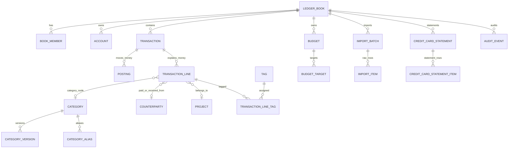

# Ledger Domain Optimization

Status: proposed
Date: 2026-05-21
Scope: Track Anywhere backend ledger domain, storage schema, migration strategy, and future workflow extension seams

## Executive Summary

Track Anywhere already has the right first layer for a personal or household
finance system: confirmed balances are derived from postings, transaction
capture is command-governed, and reporting has started moving toward
transaction lines. The main gap is not "missing CRUD tables"; it is that the
domain is currently between two states:

- the current runtime has strict `Transaction + Posting` accounting behavior,
  and the remaining transaction-level category shortcut should be retired in a
  clean cutover rather than preserved as a long-term compatibility path;
- the target design in `domain-redesign.md` is line-based and dimension-driven,
  but not all schema constraints, migration contracts, and optional workflow
  seams are physically defined yet.

This document makes the target explicit enough to implement incrementally.
The goal is not to build reimbursement, loans, imports, and credit-card
statements immediately. The goal is to make those workflows later additions
that attach to stable ledger facts rather than repeatedly reshaping core tables.

The recommended baseline is:

1. Keep `transactions` and `postings` as the canonical money movement model.
2. Make `transaction_lines` the canonical reporting and classification model.
3. Treat `ledger_books` as the namespace for all household/personal finance
   facts.
4. Preserve historical meaning through category versions and line snapshots.
5. Harden database constraints in phases, with SQLite-compatible checks first
   and stronger Postgres constraints where available.
6. Add optional workflow tables beside the ledger core, not inside it.

## Source Evidence

The current implementation supports several foundations:

| Fact | Current evidence |
| --- | --- |
| Strict confirmed ledger exists | `Ledger.create_transaction` requires at least two postings, validates account currency, enforces one book, and balances by currency in `backend/app/track_anywhere/ledger.py`. |
| Balances are derived | `Ledger.balance` derives account totals from confirmed postings and skips reversed transactions in `backend/app/track_anywhere/ledger.py`. |
| Opening balance is transactional | `AccountUseCases.create_account` creates an opening equity transaction rather than storing mutable balance on the account in `backend/app/track_anywhere/service_accounts.py`. |
| Book boundary exists | `LedgerBook` and `BookMember` exist in `backend/app/track_anywhere/books.py`. |
| Category tree and history are partially implemented | `categories.py`, `category_history.py`, and `category_models.py` already model parent/child nodes, aliases, versions, and classification events. |
| Reporting lines exist | `TransactionLine` exists in `backend/app/track_anywhere/ledger.py`, and `transaction_lines` exists in `domain_storage_models.py`. |
| Credit card metadata exists, but not card workflow semantics | `CreditCardProfile` stores limit and statement/due dates in `credit_cards.py`; purchases/payments are not first-class commands. |
| Audit exists, but is not yet canonical before/after audit | `AuditEvent` stores operation, actor, entity reference, details, and timestamp in `audit.py`. |
| Physical DB constraints are incomplete | `storage_models.py` stores many references as strings and only a subset of relationships as foreign keys. |

## Design Principles

1. **Accounting correctness comes first.** Balances come from postings only.
   Classification, tags, projects, merchants, budgets, and workflow state may
   explain money, but must not determine account balances.
2. **Book isolation is a hard boundary.** A transaction, posting, account,
   category node, budget, import batch, statement, and workflow case must belong
   to one book unless a future explicit cross-book link is introduced.
3. **Historical semantics must be reproducible.** Reports must be able to ask
   "what was recorded at the time?" and "what does the current taxonomy say?"
   without silently rewriting history.
4. **Optional workflows attach through stable seams.** Reimbursement, loans,
   imports, credit-card statements, and investment details should link to
   accounts, transactions, postings, lines, counterparties, attachments, and
   audit events rather than adding ad-hoc fields to core tables.
5. **No long-lived category compatibility debt.** Legacy category shortcuts may
   be read as migration input only. The release that backfills them must also
   remove report fallbacks, old write paths, and canonical schema dependence.

## Target Domain Map



### Core Aggregates

| Aggregate | Owns | Rule |
| --- | --- | --- |
| `LedgerBook` | book settings, members, root namespace | All mutable finance facts are book-scoped. |
| `Account` | financial location or accounting bucket | Account says where value sits, or which accounting bucket offsets a transaction. |
| `Transaction` | postings, lines, reversal pointer | Transaction is the durable business event. |
| `Posting` | account impact | Posting is the only official balance source. |
| `TransactionLine` | reporting meaning | Line answers why, for whom, under which category/project/tag/merchant/workflow. |
| `AuditEvent` | mutation and provenance trail | Audit describes who changed which fact and how. |

### Dimension Catalogs

| Dimension | Use |
| --- | --- |
| `categories` as category nodes | Stable income/expense tree, with versions and aliases. |
| `tags` | Lightweight cross-cutting labels, many-to-many on lines. |
| `projects` | Lifecycle-oriented groupings such as trips, renovations, client work, reimbursement cases, goals. |
| `counterparties` | Merchants, payees, persons, banks, employers, platforms, and aliases. |
| `classification_rules` | Deterministic import/OCR/agent classification rules. |

## Naming Reconciliation

The current physical table is `categories`. The target domain concept is
"category node". To avoid duplicate structures:

| Term | Meaning | Retirement rule |
| --- | --- | --- |
| `categories` | Current physical table and API term | Keep as the physical table, but make its rows the category node model in the cutover. Do not create a parallel category-node table. |
| `category_node` | Target domain concept | Treat each row in `categories` as one category node. |
| `category_id` | Current request/response field | Continue to mean selected category node id, but it belongs on `transaction_lines`, budgets, and rules, not on `transactions`. |
| `primary` / `secondary` | Legacy import/display shape | Use only to backfill parent/name. After cutover, drop writable columns or expose a derived read view; no command writes this shape. |
| `path_cache` | Denormalized category path | Rebuildable from parent links; kept for fast display and snapshots. |

Example path reconstruction:

```sql
select
  child.category_id,
  coalesce(parent.name, child.name) as primary_name,
  case when parent.category_id is null then null else child.name end as secondary_name,
  case
    when parent.category_id is null then child.name
    else parent.name || ' / ' || child.name
  end as path
from categories child
left join categories parent
  on parent.category_id = child.parent_id
where child.book_id = :book_id;
```

## Money And Precision Policy

The current implementation uses Python `Decimal` in the domain and stores many
amounts as strings. That is safer than floats, but it leaves precision and
validity mostly outside the database.

Target policy:

1. No `float` or `double` for money, balances, unit prices, rates, or returns.
2. Introduce an `assets` catalog before changing physical amount storage.
3. For new canonical storage, use exact units:
   - `asset_code`, currently compatible with the field name `currency`;
   - `scale`, for example CNY `2`, JPY `0`, USDC `6`;
   - `amount_units`, an integer quantity in the smallest supported unit.
4. In Postgres, use `NUMERIC(38, 0)` for `amount_units` rather than `BIGINT` so
   high-scale crypto and long-lived accounts do not hit range ceilings.
5. In SQLite compatibility mode, either keep validated integer text or use
   NUMERIC affinity plus domain-level validation. SQLite cannot be the only
   enforcement layer for exact numeric semantics.

Suggested asset catalog:

```sql
create table assets (
  asset_code text primary key,
  kind text not null check (kind in ('fiat', 'crypto', 'security', 'custom')),
  scale integer not null check (scale >= 0 and scale <= 18),
  display_scale integer not null check (display_scale >= 0 and display_scale <= 18),
  status text not null check (status in ('active', 'disabled'))
);
```

Amount migration policy:

| Phase | Write behavior | Read behavior | Exit gate |
| --- | --- | --- | --- |
| Current | String amount parsed as `Decimal` | String amount parsed as `Decimal` | No new float usage. |
| Dual-write | Write both legacy `amount` and `amount_units` | Compare decoded values in tests | 100 percent parity on migration fixtures. |
| Canonical | Write `amount_units`; keep legacy amount read-only | Reports use canonical amount | No mismatches in parity job for two consecutive releases. |
| Retire | Remove legacy amount dependency | Read adapters no longer require legacy field | Migration rollback plan accepted. |

## Core Invariants

### Transaction And Posting Invariants

| Invariant | Enforcing layer now | Target enforcing layer |
| --- | --- | --- |
| Transaction has at least two postings | Domain service | Domain service plus migration validation query. |
| Posting amount is non-zero | Domain service for commands | DB `check (amount_units <> 0)` after canonical amount migration. |
| Transaction balances by asset in same-asset transactions | Domain service | Domain service plus deferred DB validation job. |
| Posting account belongs to the transaction book | Domain service | Composite FK `(book_id, account_id)` and `(book_id, transaction_id)`. |
| Confirmed transaction is append-only | Domain service | Domain service, audit, and no update APIs for posted postings. |
| Reversal is append-only | Domain service via `reversed_by` | Reversal transaction plus FK to original transaction. |

For future foreign exchange support, do not relax same-asset balancing silently.
Add an explicit FX transaction shape:

- each asset leg is balanced against a system clearing or exchange account;
- `transaction_exchange_rates` records pair, rate, source, and valuation time;
- realized FX gain/loss is explicit if base-currency reporting needs it.

### Line And Reporting Invariants

| Invariant | Rule |
| --- | --- |
| Lines are not balance source | Reports use lines; balances use postings. |
| Expense line amount is positive | Refunds use `line_type='refund'` or negative net policy defined by report config, not ad-hoc income. |
| Pure transfer has no expense/income line | Transfer fee may create an expense line. |
| Category kind must match line type | Expense lines use expense categories; income lines use income categories. |
| Historical report is explicit | Report must state `taxonomy_mode=as_recorded|current`. |
| Reversed transactions are excluded by default | Report option must opt in to reversed data. |

### Book Isolation Invariants

All of these must be in the same book:

- transaction and postings;
- posting accounts;
- transaction lines;
- line category, project, counterparty, and tags;
- budget targets;
- recurring rules;
- import batches and generated drafts;
- credit-card statements and matched card transactions.

## Current-State To Target Mapping

| Current object/table | Target concept | Migration input | Canonical behavior | Retirement gate |
| --- | --- | --- | --- | --- |
| `transactions.category_id` | Legacy category shortcut | Backfill to `transaction_lines.category_id`. | `transactions` has no canonical category. Reports and budgets read only lines. | Same release: column is dropped, or preserved only in an unmapped archival table used by migration audits. Runtime code has no `transactions.category_id` read/write path. |
| `transaction_lines.project_id` | Project reference | Existing string accepted as pre-entity shortcut. | FK to `projects(project_id)` with book check. | Backfill maps all non-null values to project rows. |
| `transaction_lines.merchant_id` | Counterparty reference | Existing string accepted as merchant/counterparty shortcut. | FK to `counterparties(counterparty_id)` with aliases. | Backfill maps all non-null values to counterparty rows. |
| `categories.primary/secondary` | Legacy display shape | Backfill `parent_id`, `name`, `level`, `path_cache`, and versions. | Parent/name/path are canonical. | Same release: no writable primary/secondary fields remain in canonical tables or command schemas. |
| `audit_events.entity_ref` | Legacy entity reference | Backoffice and readers continue to consume it. | New shape includes entity type, id, book id, before/after. | Audit adapter serves old and new readers. |
| String `amount` columns | Legacy exact text amount | Domain parses as `Decimal`. | Exact `amount_units` plus asset scale. | Parity checks pass for all persisted rows. |

### Clean Category Retirement Plan

| Step | Write rule | Read/report rule | Validity window |
| --- | --- | --- | --- |
| Pre-cutover inventory | Existing rows may still carry `transactions.category_id`. | Only migration analysis may read transaction-level category. | Current database snapshot only. |
| Backfill transaction | All classified historical transactions receive deterministic `transaction_lines` rows. | Migration validation compares old category totals to line totals before release. | One migration transaction or fix-forward batch. |
| Cutover release | New classified writes are line-only. `transactions.category_id` is not accepted by domain commands. | Reports, budgets, and category summaries are line-only. No transaction-level category fallback ships. | Same release as backfill. |
| Post-cutover | Classified posted transactions without lines are invalid data. | App startup or CI validation fails on missing line facts. | Permanent. |

Concrete `category_id` retirement acceptance clause:

- Phase owner: backend/domain owner.
- Deadline: the Phase 2 canonical-lines release. Do not defer to optional
  dimensions.
- Gate 1: all command paths that classify a transaction create at least one
  `transaction_lines` row in the same database transaction.
- Gate 2: migration validation reports `count(classified transactions without lines) = 0`
  for all migrated books. Ambiguous rows block cutover until explicitly fixed.
- Gate 3: `category_summary` and budget execution tests pass after deleting the
  transaction-level category projection code.
- Gate 4: API and CLI contracts may keep the request field name `category_id`,
  but it maps to `transaction_lines.category_id`; no contract writes
  `transactions.category_id`.
- Gate 5: runtime app code has no dependency on `transactions.category_id` or
  writable `categories.primary/secondary`, outside the one-time migration and
  its acceptance fixtures.

## Target Table Contracts

This section describes target contracts. It is not a one-shot migration order.

### `ledger_books`

Purpose: namespace and reporting root.

Required fields:

- `book_id`
- `name`
- `kind`
- `base_asset_code`
- `timezone`
- `status`
- `settings`
- `created_by`
- timestamps and version

Constraints:

- `kind in ('personal', 'family', 'travel', 'business', 'reimbursement', 'custom')`
- `status in ('active', 'archived')`
- FK `created_by -> users.user_id`

### `book_members`

Purpose: current membership state.

Required fields:

- `book_id`
- `user_id`
- `role`
- `status`
- `scopes`
- `joined_at`
- `removed_at`
- version

Constraints:

- PK `(book_id, user_id)`
- `role in ('owner', 'admin', 'editor', 'viewer', 'auditor', 'limited_viewer')`
- removed members must have `removed_at`.

Add `book_member_events` when real shared household management starts. It should
store role changes, invite acceptance, removal, and effective timestamps.

### `accounts`

Purpose: value location or accounting bucket.

Target additions over current model:

- `status`
- `opened_at`
- `closed_at`
- `created_by`
- `created_at`
- `updated_at`
- optional `institution_account_mask`
- optional `external_ref`

Constraints:

- `unique (book_id, name)` for active accounts, or a partial unique index in
  Postgres.
- `currency` should be treated as `asset_code` in domain language.
- closed accounts reject ordinary new postings; only reversal/migration/admin
  adjustment paths may use them.

### `transactions`

Purpose: business event.

Target fields:

- `transaction_id`
- `book_id`
- `transaction_no`
- `transaction_type`
- `status`
- `occurred_at`
- `posted_at`
- `effective_date`
- `timezone`
- `source`
- `external_ref`
- `memo`
- `created_by`
- `created_at`
- `updated_by`
- `updated_at`
- `reversed_by`
- `voided_by`
- `voided_at`
- `void_reason`
- version

Recommended transaction types:

```text
expense
income
transfer
refund
reimbursement
loan_out
loan_in
debt_repayment
credit_card_purchase
credit_card_payment
balance_adjustment
opening_balance
investment_event
fx_exchange
```

Recommended statuses:

```text
draft
posted
reconciled
voided
```

Rules:

- Classification does not live on `transactions`; it lives on
  `transaction_lines`.
- `posted` and `reconciled` transactions do not mutate postings in place.
- `reconciled` transactions are corrected by reversal or adjustment.
- `voided` transactions must record actor, time, and reason.

### `postings`

Purpose: official account impact.

Target fields:

- `posting_id`
- `book_id`
- `transaction_id`
- `position`
- `account_id`
- `amount_units`
- `asset_code`
- optional `memo`
- timestamps

Constraints:

- FK `(book_id, transaction_id) -> transactions(book_id, transaction_id)`
- FK `(book_id, account_id) -> accounts(book_id, account_id)`
- `amount_units <> 0`
- `unique (transaction_id, position)`

### `transaction_lines`

Purpose: reporting and classification unit.

Target fields:

- `line_id`
- `book_id`
- `transaction_id`
- `position`
- `line_type`
- `amount_units`
- `asset_code`
- `category_id`
- `category_version_id`
- `category_path_snapshot`
- `counterparty_id`
- `project_id`
- `necessity`
- `reimbursement_status`
- `memo`
- version

Recommended line types:

```text
expense
income
refund
transfer_fee
adjustment
tax
interest
principal
investment_gain_loss
```

Rules:

- A line explains a reporting amount, not necessarily every posting.
- Split receipts create multiple lines.
- Refund lines should link to an original line when known.
- Loan and credit-card principal/interest splits use lines, but account balance
  correctness still comes from postings.

### `categories`

Purpose: physical category node table.

Keep current table name unless a future migration explicitly renames it.

Target constraints:

- no writable `primary` or `secondary` category command fields after the
  cutover. If old clients need that display, provide a derived view from
  parent/name/path.
- `unique (book_id, kind, parent_id, normalized_name)` for active nodes.
- `kind in ('expense', 'income')`
- `level in (1, 2)` for the current product.
- a second-level node must have a first-level parent in the same book and kind.
- category archive/hide is preferred over hard delete once referenced.

### `category_versions`

Purpose: historical category meaning.

Rules:

- Every classified line stores the category version active at classification
  time.
- Changing name, parent, icon/color, merge, or archive creates a new version or
  classification event.
- Reports choose recorded snapshot or current tree explicitly.

### `counterparties`

Purpose: normalized merchants, payees, people, banks, employers, platforms.

Minimal target fields:

- `counterparty_id`
- `book_id`
- `display_name`
- `normalized_name`
- `type`
- `default_category_id`
- `status`
- metadata

Supporting table: `counterparty_aliases`.

Use one table rather than separate merchant/payee tables at first. Add
specialized views later if product semantics require them.

### `tags` And `transaction_line_tags`

Purpose: lightweight many-to-many labels.

`tags` fields:

- `tag_id`
- `book_id`
- `name`
- `normalized_name`
- `tag_type`
- `color`
- `status`

`transaction_line_tags` fields:

- `line_id`
- `tag_id`
- `book_id`
- `created_by`
- `created_at`

Constraints:

- `unique (book_id, normalized_name)`
- FK `line_id` and `tag_id` must both belong to the same book.

### `projects`

Purpose: lifecycle dimension such as trip, renovation, client work,
reimbursement case, or goal.

Fields:

- `project_id`
- `book_id`
- `name`
- `kind`
- `status`
- `starts_on`
- `ends_on`
- `budget_amount_units`
- `asset_code`
- metadata

Projects are used when the dimension has lifecycle, ownership, or budget. Tags
are used for lightweight labels.

### `budgets` And `budget_targets`

Purpose: plans and limits, not ledger facts.

Rules:

- Budget execution consumes transaction lines, not postings directly.
- Budget query must require `from`, `to`, `date_basis`, and currency/asset mode.
- Category budgets target category node or subtree ids.
- Project, tag, and counterparty budgets target those dimension ids.
- Credit-card payment, pure transfer, and loan principal settlement do not count
  as ordinary spend unless a specific budget policy opts in.

### `audit_events`

Current shape:

```text
operation
actor_id
actor_type
entity_ref
details
created_at
```

Target shape:

```text
event_id
book_id
operation
entity_type
entity_id
actor_id
actor_type
request_context
before
after
details
created_at
```

Migration strategy:

- dual-write new fields while preserving old `entity_ref`;
- provide a read adapter that maps old rows to canonical shape where possible;
- redact memo/note/OCR/raw payload/token/account/card data before persistence;
- add backoffice compatibility until consumers use the canonical shape.

## Constraint Matrix

| Area | Constraint | Layer now | Target DB enforcement |
| --- | --- | --- | --- |
| Book isolation | Account, transaction, posting, line, category, budget target must share book | Domain service | Composite FKs on `(book_id, id)`. |
| Transaction postings | At least two postings per posted transaction | Domain service | Validation job or deferred trigger where supported. |
| Posting amount | Non-zero exact amount | Domain command | `check (amount_units <> 0)`. |
| Transaction balance | Sum postings by asset equals zero for same-asset transactions | Domain service | Validation query in migration/CI; trigger only if practical. |
| Account currency | Posting asset equals account asset unless explicit FX flow | Domain service | Composite FK plus check through domain service. |
| Category kind | Expense lines cannot use income category, and vice versa | Domain service | Domain service plus optional trigger/report validation. |
| Category uniqueness | No duplicate active node under same parent/kind/book | Domain service | Unique index or partial unique index. |
| Alias uniqueness | Alias resolves to one active category per book | Domain service | Unique `(book_id, normalized_alias)` for active aliases. |
| Reversal | One original transaction has at most one active reversal | Domain service | Unique `reversed_by` or reversal link table. |
| Import duplicate | Same source item cannot create duplicate draft/transaction | Not implemented | Unique `(book_id, source, external_id)` or `(book_id, source, fingerprint)`. |
| Statement duplicate | Same card statement period cannot duplicate | Not implemented | Unique `(book_id, account_id, statement_start, statement_end)`. |
| Budget periods | Budget period has valid start/end and positive amount | Domain command | `check (period_end >= period_start)` and positive amount. |

SQLite notes:

- Keep domain validation as the primary enforcement for complex invariants.
- Use SQLite-supported foreign keys and check constraints wherever possible.
- Treat Postgres composite FKs and partial unique indexes as production
  strengthening, not a reason to skip domain checks.

## Deferred Workflow Extension Seams

### Reimbursement

Do not implement full reimbursement now. Make it cheap to add later by ensuring:

- transaction lines already have `reimbursement_status`;
- projects can represent reimbursement cases;
- counterparties can represent employer/client/platform;
- attachments can link to transactions or lines;
- audit can record claim submission and status changes.

Future tables:

```text
reimbursement_claims
  claim_id
  book_id
  project_id nullable
  counterparty_id
  status
  submitted_at
  settled_at
  expected_amount_units
  asset_code

reimbursement_claim_lines
  claim_id
  line_id
  reimbursable_amount_units
  asset_code
```

No core ledger table should need a new column when this workflow is enabled.

### Loans, Receivables, And Payables

Initial support should use accounts:

- loan out: asset cash decreases, receivable account increases;
- repayment: asset cash increases, receivable decreases;
- loan in: asset cash increases, payable/liability increases;
- repayment: asset cash decreases, payable/liability decreases.

Future tables:

```text
loan_agreements
  loan_id
  book_id
  counterparty_id
  direction
  principal_amount_units
  asset_code
  interest_policy
  status

loan_schedule_items
  schedule_item_id
  loan_id
  due_date
  principal_due_units
  interest_due_units
  status

loan_transaction_links
  loan_id
  transaction_id
  role
```

This keeps debt schedule management outside the posting core.

### Import And Bank Statement Ingestion

Imports should first create raw/staging facts, then drafts or matched
transactions.

Future tables:

```text
import_batches
  import_batch_id
  book_id
  source
  account_id
  file_hash
  imported_by
  imported_at
  status

import_items
  import_item_id
  import_batch_id
  book_id
  external_id nullable
  fingerprint
  occurred_at
  posted_at
  amount_units
  asset_code
  raw_data
  status
  draft_id nullable
  transaction_id nullable
```

Constraints:

- unique `(book_id, source, external_id)` when `external_id` exists;
- unique `(book_id, source, fingerprint)` as fallback;
- raw import data never directly changes balances.

### Credit-Card Statements

Current credit-card profile metadata should remain separate from liability
balance. The missing workflow is statement lifecycle and matching.

Future tables:

```text
credit_card_statements
  statement_id
  book_id
  account_id
  statement_start
  statement_end
  due_date
  total_due_units
  minimum_due_units
  asset_code
  status

credit_card_statement_items
  statement_item_id
  statement_id
  occurred_at
  posted_at
  amount_units
  asset_code
  description
  counterparty_id nullable
  matched_transaction_id nullable

credit_card_statement_payments
  statement_id
  payment_transaction_id
  amount_units
  asset_code
```

Rules:

- Card purchase increases credit-card liability and creates an expense line.
- Card payment reduces asset cash/bank and reduces card liability.
- Card payment is not ordinary expense.
- Statement rows are reconciliation facts; postings remain the balance source.

### Foreign Exchange

Do not allow cross-currency postings to bypass balance checks. Add explicit FX
facts only when needed:

```text
transaction_exchange_rates
  transaction_id
  from_asset_code
  to_asset_code
  rate
  rate_source
  rate_at
```

Reports can later use base-book valuation without changing posting semantics.

## Migration Strategy

### Phase 0: Design Lock And Baseline Evidence

Preconditions:

- This document is accepted.
- Existing tests pass.
- Current schema, migrations, and public API snapshots are captured.

Postconditions:

- Open decisions are recorded with owners.
- No code behavior changes are required.

### Phase 1: Core Constraint Hardening

Scope:

- Add missing status fields and timestamps where needed.
- Add composite uniqueness for book-scoped identities.
- Add validation jobs for cross-book references and orphan rows.
- Add asset catalog and write-time amount scale validation.

Rollback/fix-forward:

- Add nullable columns first.
- Backfill.
- Validate.
- Only then make required fields not-null.

Acceptance:

- `constraint_matrix_rejects_cross_book_posting`
- `posting_amount_scale_validation`
- baseline persistence tests still pass.

### Phase 2: Canonical Transaction Lines

Scope:

- Backfill transaction lines for all categorized transactions.
- Remove transaction-level category report and budget projection in the same
  release.
- Make new classified transaction writes create lines only.
- Add validation that lines and line categories share book.
- Drop `transactions.category_id`, or move its values into an archival
  migration-audit table that is not mapped by runtime models.

Backfill rules:

- For an expense category, derive line amount from positive postings to expense
  accounts.
- For an income category, derive line amount from negative postings from income
  accounts.
- If a legacy transaction cannot derive exactly one line, mark it for manual
  migration review and block cutover rather than guessing.

Acceptance:

- `legacy_transaction_category_id_backfill_cutover`
- `budget_execution_after_line_backfill`
- `reversal_exclusion_preserved_during_migration`

### Phase 3: Category Versions And Taxonomy Hardening

Scope:

- Treat `categories` as category node table only; old primary/secondary writes
  are already retired.
- Ensure every line has `category_version_id` and path snapshot.
- Add category alias and classification event validation.
- Provide any legacy primary/secondary display through derived read models, not
  stored canonical fields.

Acceptance:

- `category_node_cutover_roundtrip`
- category rename/version replay tests from `test_domain_redesign.py`
- category summary tests remain line-only.

### Phase 4: Optional Dimensions

Scope:

- Add `tags`, `transaction_line_tags`, `projects`, `counterparties`,
  `counterparty_aliases`, and classification rule tables.
- Backfill existing `project_id` and `merchant_id` shortcuts to entities.
- Add reports by project/counterparty/tag.

Feature state:

| Feature | Tables available | Workflow enabled |
| --- | --- | --- |
| Tags | Yes | Assignment/reporting only. |
| Projects | Yes | Project reports/budgets only. |
| Counterparties | Yes | Normalization/reporting only. |
| Reimbursement | Uses project/counterparty/line status | Full claim workflow off. |
| Loans | Uses accounts/counterparty | Schedule workflow off. |
| Imports | Uses import staging | Auto-posting off. |
| Credit-card statements | Uses statement tables | Matching workflow off until tests pass. |

### Phase 5: Workflow Modules

Implement only when product need appears:

- reimbursement claims;
- loan schedules and settlements;
- import classification and duplicate handling;
- credit-card statement matching;
- FX/base-currency valuation.

Each module must prove it does not change core posting invariants.

## Migration Acceptance Fixtures

### `category_node_cutover_roundtrip`

Fixture:

- book `book_default`;
- category rows:
  - expense `餐饮 / 午餐`;
  - expense `交通`;
  - income `工资 / 主业`.

Assertions:

- each first-level node has `parent_id is null`;
- each second-level node references same-book, same-kind parent;
- path reconstruction returns the original primary/secondary display;
- no duplicate active `(book_id, kind, parent_id, normalized_name)`.
- no command schema or storage writer requires writable primary/secondary
  category fields.

### `legacy_transaction_category_id_backfill_cutover`

Fixture:

- one pre-cutover transaction with `category_id` and no `transaction_lines`;
- postings: cash `-38`, expense system/account `+38`;
- one canonical transaction with equivalent persisted line.

Assertions:

- migration creates a persisted line for the pre-cutover transaction;
- line-only report amount is `76`;
- no report code path projects from `transactions.category_id`;
- if a classifiable pre-cutover row lacks a persisted line, migration
  validation fails before app startup.

### `reversal_exclusion_preserved_during_migration`

Fixture:

- one posted expense transaction with amount `50`;
- one reversal transaction linked by `reversed_by`.

Assertions:

- balance uses original and reversal postings as recorded;
- spending reports exclude reversed original by default;
- migration does not create reporting lines that make reversed spending reappear.

### `budget_execution_after_line_backfill`

Fixture:

- monthly food budget target on category subtree `餐饮`;
- one pre-cutover categorized transaction `20`;
- one canonical line transaction `30`;
- one transfer transaction `100` without expense line.

Assertions:

- migration backfills a line for the pre-cutover transaction;
- line-only budget spent is `50`;
- transfer does not count;
- budget code has no transaction-level category fallback.

### `idempotent_migration_rerun`

Fixture:

- database already partially backfilled with some transaction lines and category
  versions.

Assertions:

- running migration twice does not duplicate lines, aliases, versions, or
  classification events;
- row counts remain stable on second run;
- fingerprints or deterministic keys identify generated rows.

### `audit_dual_write_redacts_sensitive_fields`

Fixture:

- command details include `memo`, token-like field, raw OCR text, and ordinary
  structured fields.

Assertions:

- old audit view still returns `operation`, actor, entity reference, details;
- new canonical audit event includes `entity_type`, `entity_id`, `book_id`,
  `before`, `after`;
- sensitive fields are redacted in both shapes.

### `constraint_matrix_rejects_cross_book_posting`

Fixture:

- transaction belongs to book A;
- account belongs to book B.

Assertions:

- domain service rejects the command;
- migration validation query detects any manually inserted row;
- Postgres composite FK rejects the row once constraint is enabled.

## Query And Reporting Policy

Every report must state:

- `book_id` or explicit `book_ids`;
- date range;
- `date_basis`: `occurred_at`, `posted_at`, or `effective_date`;
- `taxonomy_mode`: `as_recorded` or `current`;
- `include_reversed`: false by default;
- `asset_mode`: native asset groups first, base-book conversion only when FX
  valuation exists.

Spending report default:

```text
book_id = required
date_basis = occurred_at
taxonomy_mode = as_recorded
include_reversed = false
line_type in ('expense', 'transfer_fee')
line_type='refund' nets against original category when linked or configured
exclude pure transfer and credit-card payment
```

Budget report default:

```text
period = budget period or explicit date range
date_basis = occurred_at
source = transaction_lines
exclude transfer, credit-card payment, loan principal, and reimbursable lines
unless budget target policy opts in
```

## API And Command Direction

New APIs should prefer book-scoped routes:

```text
GET    /api/v1/books/{book_id}/accounts
POST   /api/v1/books/{book_id}/accounts
GET    /api/v1/books/{book_id}/transactions
POST   /api/v1/books/{book_id}/transactions
POST   /api/v1/books/{book_id}/transactions/{transaction_id}/reverse
GET    /api/v1/books/{book_id}/reports/spending
GET    /api/v1/books/{book_id}/budgets/{budget_id}/execution
```

Compatibility wrappers may remain:

```text
/api/v1/accounts
/api/v1/expenses
/api/v1/incomes
/api/v1/summary/categories
```

Compatibility rule:

- wrappers resolve `book_default`;
- wrappers must call the same domain use cases as book-scoped routes;
- new features should not be added only to default-book wrappers.

## Architecture Boundaries

Recommended module direction:

| Layer | Owns |
| --- | --- |
| `commands.py` / future command modules | Input contracts and schema versioning. |
| `service_*` | Use case orchestration, auth, idempotency, audit, transaction boundaries. |
| `ledger.py`, `categories.py`, `budgets.py`, etc. | Domain invariants and pure behavior. |
| `storage_models.py`, `domain_storage_models.py`, migrations | Physical persistence and constraints. |
| API routers | HTTP transport, dependency injection, serialization, error mapping. |

Do not add workflow-specific accounting rules directly into routers. For example
credit-card payment should be a use case that emits a normal balanced
transaction, not a route-local special case.

## Open Decisions Register

| Decision | Current recommendation | Owner | Deadline | Pass/fail criterion |
| --- | --- | --- | --- | --- |
| Amount storage final form | `amount_units` exact units with `assets.scale`; keep Decimal domain API | Backend/domain owner | Before Phase 1 implementation PR | Parity tests pass for CNY, JPY, USD, USDC fixtures. |
| Physical category rename | Keep `categories` table; use category node as domain term | Backend/domain owner | Before Phase 3 migration PR | No duplicate category node table exists without an explicit rename plan. |
| Category depth | Keep depth exactly 2 | Product/domain owner | Before any third-level category request is accepted | Report compatibility plan exists before depth change. |
| Counterparty vs merchant/payee split | Start with one `counterparties` table and type field | Product/domain owner | Before Phase 4 implementation PR | Import, manual payment, and merchant report examples all map cleanly. |
| Necessity representation | Keep enum on line plus optional tag type later | Product/domain owner | Before necessity-based budget ships | Budget/report tests prove expected grouping. |
| SQLite vs Postgres enforcement | Maintain SQLite compatibility, strengthen with Postgres constraints | Backend/platform owner | Before production deployment decision | Constraint matrix identifies enforcement layer for every invariant. |
| Legacy category implementation retirement | Retire transaction-level categories and primary/secondary writes in Phase 2 cutover | Backend/domain owner | Before Phase 3 starts | Runtime code has no `transactions.category_id` dependency, reports are line-only, and canonical category writes use node parent/name. |

## ADR: Normalized Ledger Core With Deferred Workflow Seams

Decision:

Adopt a normalized, book-scoped ledger core built on transactions, postings, and
transaction lines. Keep optional workflows as adjacent modules that link to the
core through stable ids and audit events.

Drivers:

- Existing runtime already enforces balanced postings and derived balances.
- Future workflows need line-level meaning, counterparty, project, tags,
  attachments, imports, and audit provenance.
- Historical reports and household sharing require stable book and taxonomy
  boundaries.

Alternatives considered:

1. Minimal extension of current schema through nullable/JSON columns.
   - Rejected as a long-term baseline because it repeats future migrations for
     every workflow and weakens queryability.
2. JSON-only workflow state in audit/details.
   - Rejected because reports, reconciliation, and duplicate detection need
     indexed facts.
3. Full workflow implementation now.
   - Rejected because reimbursement, loans, imports, and statements do not need
     to ship together. Only their extension seams need to be stable.

Consequences:

- More up-front schema and migration discipline.
- Lower long-term churn when deferred workflows arrive.
- Legacy category state is treated as migration input and removed from the
  runtime model in the cutover release.

## Document Quality Gates For Implementation Plans

Any future PRD or implementation plan based on this document must prove:

- every changed money path has a before/after balance invariant test;
- every migration phase has preconditions, postconditions, rollback or
  fix-forward policy, and acceptance tests;
- every new optional workflow links through transaction, line, account, book,
  counterparty, project, tag, attachment, or audit facts;
- no new workflow stores authoritative balance outside postings;
- no new report silently mixes occurred date, posted date, and effective date;
- no new compatibility shortcut lacks a retirement gate, and category
  compatibility shortcuts are not reintroduced after cutover.
