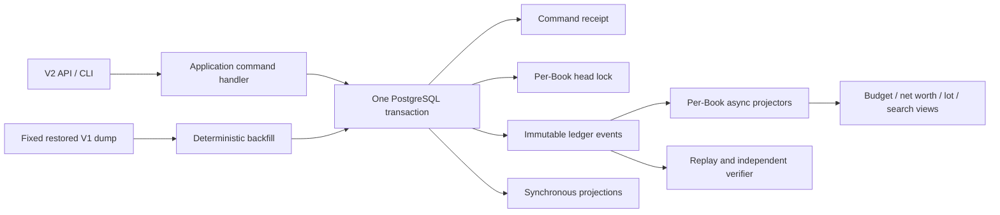

# Track Anywhere V2 Event Ledger Design

Status: approved
Date: 2026-07-13
Scope: greenfield V2 ledger core, V2 API/CLI boundary, deterministic V1 backfill, and V1 retirement
Source review: `docs/reviews/2026-07-13-track-anywhere-v2-chatgpt-pro-review.md`

## Executive decision

Track Anywhere V2 will be rebuilt as a moderate event ledger:

- immutable events are the source of truth for confirmed financial facts and their reporting assignments;
- catalogs and workflow state remain ordinary CRUD;
- journal, postings, balances, reversal state, and current reporting lines are projected in the same PostgreSQL transaction as the event append;
- slower reports are asynchronous, rebuildable projections with per-Book checkpoints;
- V1 is not an online compatibility target. A fixed V1 dump is imported later by a deterministic, independently verified backfill application;
- the current task may build and validate an isolated V2 environment, but it does not deploy production.

Two product defaults are fixed:

- USDT uses `ledger_scale=8`, `input_scale=6`, and `display_scale=6`;
- investment lot event/schema contracts are included in V2, while the first cutover defers lot UI and advanced performance reports.

The design intentionally corrects one issue in the Pro proposal: PostgreSQL sequence values are allocation order, not commit order. `global_sequence` is therefore diagnostic only. Correct replay and asynchronous projection order use `(book_id, book_position)` and per-Book checkpoints.

## Goals and non-goals

### Goals

1. Make every confirmed balance reproducible from immutable, exact-unit financial events.
2. Enforce Book, account, asset, posting, balance, reversal, and stream invariants in both the domain and PostgreSQL 17.
3. Make command idempotency correct across processes and unknown commit outcomes.
4. Remove startup hydration, process-local read truth, duplicate validators, mutable-ledger persistence, and String amount casts.
5. Make projection rebuild, V1 backfill, and verification deterministic and crash-resumable.
6. Establish explicit API V2, CLI, migration, observability, privacy, and cutover contracts.

### Non-goals

- no `/api/v1` wrapper, V1 dual-write, or schema-in-place compatibility migration;
- no production deployment in this phase;
- no pure event sourcing for users, authentication, Book membership, catalogs, drafts, budgets, attachments, or operational settings;
- no promise that the in-database hash chain resists a privileged database administrator;
- no SQLite persistence compatibility for V2 ledger integration tests;
- no investment lot UI or advanced return analytics in the first cutover.

## System boundaries



### Event-sourced facts

- confirmed Journal Transaction;
- full reversal and atomic correction;
- changes to financial external references;
- Reporting Line assignment and clearing;
- FX execution facts;
- investment lot acquisition, disposal, and fixed allocation.

### CRUD and workflow state

- users, auth identities, credentials, and current Book membership;
- Books, assets, accounts, categories, counterparties, projects, and immutable referenced catalog versions;
- budgets, recurring rules, drafts, payment instruments/profiles, and valuations;
- attachments, import jobs, quarantine decisions, and operational configuration.

A Draft is not a financial fact. Confirmation creates a new ledger command; after success the Draft records only `confirmed_transaction_id`. A Draft never participates in replay.

Catalog rows referenced by events use stable IDs, cannot be hard-deleted, and cannot change accounting meaning. Names may change, but Book ownership, account asset, account system role, and asset `ledger_scale` become immutable when first referenced. Close and soft-delete operations preserve replayability.

## Domain model and invariants

| Object | Responsibility | Invariant |
| --- | --- | --- |
| Book | tenant and serialization boundary | every command, event, account, projection, and checkpoint is Book-scoped |
| Asset | exact quantity policy | `ledger_scale` immutable after use; input/display scales do not change stored meaning |
| Account | posting destination | one Book, one Asset; referenced account cannot move or hard-delete |
| Journal Transaction | atomic accounting fact | at least two postings; every Asset balances independently |
| Posting | smallest accounting fact | positive integer units plus explicit debit/credit side; immutable |
| Reporting Line | analytical allocation | never affects balances; replaced by revisioned events |
| Reversal | compensating transaction | exact, full inverse; unique against the original; no cross-Book link or cycle |
| FX | multi-asset exchange | each Asset balances through a Book-owned trading account |
| Investment Lot | acquisition/disposal allocation | allocation is stored in the disposal event and is never re-selected during replay |

Normal posting amounts are always positive. Sign comes only from `side`. Zero, negative zero, negative units, scientific notation, implicit quantization, and floats are rejected.

For an FX purchase of 100 USD for 700 CNY, the event contains four balanced postings:

- debit USD wallet 100 USD;
- credit USD trading account 100 USD;
- debit CNY trading account 700 CNY;
- credit CNY bank 700 CNY.

The displayed rate is derived from the two integer quantities. It is not a balancing fact.

## Event model

### Envelope

Every event stores:

- `event_id`, `book_id`, `book_position`;
- diagnostic `global_sequence`, which may contain gaps and is never a correctness checkpoint;
- `stream_type`, `stream_id`, and continuous `stream_version`;
- `event_type` and immutable `event_schema_version`;
- `command_id`, stable `actor_subject_id`, `correlation_id`, and optional `causation_event_id`;
- `effective_at` and database-produced `recorded_at`;
- typed JSONB payload;
- `previous_hash` and `event_hash`.

`book_position` is the causal/replay order. `effective_at` is the reporting date. A late event may be appended at the Book tail while invalidating an older report period.

### Required event contracts

`JournalTransactionPosted.v1` contains the complete transaction and ordered posting set in one event. Each posting includes stable ID, position, account ID, asset code, side, and canonical units string. Transaction kinds include at least `standard`, `opening`, `adjustment`, `transfer`, `fx`, and `investment_cash`.

`JournalTransactionReversed.v1` contains the reversal transaction, original event ID/hash, reason code, and full inverse postings. The server constructs the inverse from the original stored event, never from a client payload or mutable projection.

`JournalTransactionCorrected.v1` is an application command boundary rather than a mutable event. In one database transaction it appends the complete reversal and replacement event batch, so clients never observe a half-corrected state.

`ReportingLinesAssigned.v1` is a replace-all snapshot with `classification_revision`, stable catalog/version IDs, exact assigned asset/units, line type, and normalized enum dimensions. `ReportingLinesCleared.v1` explicitly clears the assignment.

`InvestmentLotAcquired.v1` and `InvestmentLotDisposed.v1` preserve exact quantity/cost units and the final deterministic lot allocation. Replay never reruns FIFO or Specific ID selection.

### Schema, serialization, and hash

- Every `(event_type, event_schema_version)` has a dedicated Pydantic model and committed JSON Schema.
- Arbitrary `dict[str, Any]` cannot enter the event writer.
- Units in JSON are canonical unsigned base-10 strings; application code converts them to Python `int`; database projections store `numeric(...,0)`.
- Canonical serialization has golden byte fixtures for Unicode, key order, UTC timestamps, UUIDs, large integers, and optional fields.
- Upcasters are pure functions. They cannot read catalogs, current time, network state, or mutate stored payloads.
- Hashes are computed from the stored schema version and canonical stored bytes, not an upcast model.
- The hash input includes Book/stream positions, IDs, type/version, command/correlation/causation, actor subject, fixed UTC `effective_at`, previous hash, and payload. It excludes diagnostic global sequence, database `recorded_at`, and projections.

The hash chain detects accidental or unauthorized mutation when compared with a trusted terminal hash. It is not tamper-proof against an administrator who can rewrite the entire database. A later hardening phase may sign each Book terminal hash and anchor it to external/WORM storage.

## PostgreSQL 17 physical model

V2 starts from a clean PostgreSQL 17 schema and a new `v2_0001` Alembic baseline. The old migration tree is not an upgrade path; Git and the frozen V1 extractor preserve its history.

The following is the normative core shape. The implementation plan may split it into migrations, but may not weaken the constraints.

```sql
CREATE TYPE posting_side AS ENUM ('debit', 'credit');
CREATE TYPE receipt_status AS ENUM ('processing', 'completed');

CREATE TABLE books (
    book_id uuid PRIMARY KEY,
    name text NOT NULL CHECK (btrim(name) <> ''),
    base_asset_code varchar(16),
    created_at timestamptz NOT NULL DEFAULT clock_timestamp()
);

CREATE TABLE assets (
    asset_code varchar(16) PRIMARY KEY,
    kind varchar(32) NOT NULL,
    ledger_scale smallint NOT NULL CHECK (ledger_scale BETWEEN 0 AND 30),
    input_scale smallint NOT NULL CHECK (input_scale BETWEEN 0 AND ledger_scale),
    display_scale smallint NOT NULL CHECK (display_scale BETWEEN 0 AND ledger_scale),
    name text NOT NULL,
    status varchar(16) NOT NULL CHECK (status IN ('active', 'disabled')),
    version integer NOT NULL DEFAULT 1 CHECK (version > 0)
);

CREATE TABLE accounts (
    book_id uuid NOT NULL REFERENCES books(book_id),
    account_id uuid NOT NULL,
    asset_code varchar(16) NOT NULL REFERENCES assets(asset_code),
    account_type varchar(32) NOT NULL,
    system_role varchar(32),
    name text NOT NULL CHECK (btrim(name) <> ''),
    status varchar(16) NOT NULL CHECK (status IN ('active', 'closed')),
    version integer NOT NULL DEFAULT 1 CHECK (version > 0),
    PRIMARY KEY (book_id, account_id),
    UNIQUE (book_id, account_id, asset_code)
);

CREATE UNIQUE INDEX ux_accounts_system_role
ON accounts(book_id, asset_code, system_role)
WHERE system_role IS NOT NULL;

CREATE TABLE book_event_heads (
    book_id uuid PRIMARY KEY REFERENCES books(book_id),
    last_position bigint NOT NULL DEFAULT 0 CHECK (last_position >= 0),
    last_hash bytea NOT NULL CHECK (octet_length(last_hash) = 32)
);

CREATE SEQUENCE ledger_global_sequence;

CREATE TABLE ledger_events (
    event_id uuid PRIMARY KEY,
    global_sequence bigint NOT NULL DEFAULT nextval('ledger_global_sequence'),
    book_id uuid NOT NULL REFERENCES books(book_id),
    book_position bigint NOT NULL CHECK (book_position > 0),
    stream_type varchar(32) NOT NULL,
    stream_id uuid NOT NULL,
    stream_version integer NOT NULL CHECK (stream_version > 0),
    event_type varchar(64) NOT NULL,
    event_schema_version smallint NOT NULL CHECK (event_schema_version > 0),
    command_id uuid NOT NULL,
    actor_subject_id varchar(128) NOT NULL,
    correlation_id uuid NOT NULL,
    causation_event_id uuid REFERENCES ledger_events(event_id),
    effective_at timestamptz NOT NULL,
    recorded_at timestamptz NOT NULL DEFAULT clock_timestamp(),
    payload jsonb NOT NULL CHECK (jsonb_typeof(payload) = 'object'),
    previous_hash bytea NOT NULL CHECK (octet_length(previous_hash) = 32),
    event_hash bytea NOT NULL CHECK (octet_length(event_hash) = 32),
    UNIQUE (global_sequence),
    UNIQUE (book_id, book_position),
    UNIQUE (book_id, stream_type, stream_id, stream_version),
    UNIQUE (book_id, event_hash)
);

CREATE TABLE command_receipts (
    actor_subject_id varchar(128) NOT NULL,
    book_id uuid NOT NULL REFERENCES books(book_id),
    operation varchar(96) NOT NULL,
    idempotency_key_hash bytea NOT NULL CHECK (octet_length(idempotency_key_hash) = 32),
    request_hash bytea NOT NULL CHECK (octet_length(request_hash) = 32),
    command_id uuid NOT NULL UNIQUE,
    status receipt_status NOT NULL,
    response_schema_version smallint,
    result_status smallint,
    result_body jsonb,
    first_book_position bigint,
    last_book_position bigint,
    created_at timestamptz NOT NULL DEFAULT clock_timestamp(),
    completed_at timestamptz,
    PRIMARY KEY (actor_subject_id, book_id, operation, idempotency_key_hash)
);
```

`journal_transactions`, `journal_postings`, `account_balances`, reversal state, and current `reporting_lines` are synchronous projection tables. Required constraints include:

- composite Book foreign keys everywhere;
- posting FK `(book_id, account_id, asset_code)` to the account triple;
- positive `numeric(38,0)` posting units and `numeric(48,0)` accumulated balance units;
- unique `(book_id, transaction_id, posting_position)` and posting ID;
- unique reversal target within a Book;
- a `DEFERRABLE INITIALLY DEFERRED` constraint trigger requiring at least two postings and zero debit-minus-credit sum for every affected `(book_id, transaction_id, asset_code)` at commit;
- database triggers preventing mutation of referenced asset scale, account Book/Asset/system role, and hard deletion of referenced catalogs.

No event-store, repository, concurrency, migration, or backfill gate may use SQLite as a substitute for these PostgreSQL semantics.

## Command and idempotency protocol

Every financial command requires an idempotency key. The raw key is never logged or stored. Its scope is stable actor subject + Book + operation + SHA-256 key hash. The request hash covers command schema version, canonical request body, Book, and authorization scope.

The server first checks current authorization, including on replay. Then one PostgreSQL transaction performs:

1. insert a `processing` receipt using `ON CONFLICT DO NOTHING`;
2. on conflict, lock/read the existing receipt; different request hash returns 409, the same completed request returns the stored response;
3. lock the target `book_event_heads` row `FOR UPDATE`;
4. load immutable catalog facts and expected stream versions;
5. validate and build the full typed event batch;
6. append events with consecutive Book positions and hashes;
7. update synchronous projections;
8. mark the receipt `completed` with a versioned response;
9. commit.

An exception rolls back the receipt, events, and projections together. A `processing` receipt must never be visible as committed state. A client that loses the commit response retries with the same key. Financial receipts are retained; they are not expired by a lease or cleanup job.

External side effects are not performed inside a command handler. A transactional outbox is written with the ledger transaction and delivered at least once. Consumers deduplicate by stable message ID.

## Projection model

### Synchronous projections

- journal transaction and postings;
- exact current account balances;
- reversal target/status;
- current Reporting Lines and revision;
- Book committed position.

These are updated in the append transaction. A successful API response guarantees a new database connection can immediately read the same Book position and balances. There is no process-local full-book cache or startup hydration.

### Asynchronous projections

- monthly/category summaries and dirty-period rebuild state;
- budget actuals and net worth;
- FX performance;
- investment lot/read views;
- search and analytics.

Checkpoint identity is `(projection_name, projector_version, book_id)` with `last_book_position`. Workers may process different Books concurrently but serialize a given projection/Book using row or advisory locks. `global_sequence` cannot advance a correctness checkpoint.

Projectors are idempotent by source event ID. Checkpoint advancement and projection writes share one transaction. Unknown event type/schema pauses that Book projection and alerts; events are never skipped.

Late `effective_at` events mark affected reporting periods dirty. Incremental projectors must recompute the affected period or produce the same result as a cold replay. Book position defines event causality; effective time defines report allocation.

Rebuild uses versioned shadow generations:

1. snapshot each Book head;
2. replay from position 1 into a shadow generation;
3. catch up each Book to current head;
4. briefly lock the projector, catch the final delta, and atomically flip the active generation;
5. retain the old generation for an observation period.

A crash can discard or resume the shadow build without changing the active view.

## Privacy and audit data

The immutable event payload is PII-minimized. It contains stable subject/catalog IDs, financial enums, quantities, and provenance hashes, but not credentials, raw idempotency keys, attachment bytes/names, or unnecessary free-text merchant/memo fields.

Human-readable memo, counterparty display data, and other deletable text live in a protected sidecar referenced by stable ID. Sensitive sidecars may use per-Book encryption keys so a deletion request can use crypto-erasure without breaking financial replay. Referenced category versions are immutable/soft-deleted; financial correctness never depends on decrypting display text.

Logs contain command ID, hashed idempotency identity, Book ID, event position range, correlation ID, and projection name/version. They do not contain raw keys, credentials, attachment content, or full memo text.

## Repository and runtime cutover

The current `backend/app/track_anywhere/api.py` file conflicts with the target `api/v2` package. V2 replaces it with `api/__init__.py` and `api/app.py`; `backend/app/main.py` may keep `from track_anywhere.api import app`.

Target structure:

```text
backend/app/track_anywhere/
  api/{__init__.py,app.py,dependencies.py,errors.py}
  api/v2/{router.py,commands.py,queries.py,schemas.py}
  application/{command_bus.py,unit_of_work.py,journal/,investments/}
  domain/money/
  domain/journal/
  domain/reporting/
  domain/investments/
  infrastructure/db/{base.py,engine.py,unit_of_work.py,event_store.py,idempotency.py,models/}
  infrastructure/projections/{synchronous.py,worker.py,checkpoints.py,rebuild.py}
  serialization/{canonical_json.py,event_registry.py,upcasters.py}
  queries/{journal.py,balances.py,reporting.py,investments.py}
  outbox/
  observability/

backend/tools/backfill_v1/
  extract.py inventory.py normalize.py generate.py load.py
  checkpoint.py quarantine.py manifest.py verify.py verify_determinism.py
```

`OrmStorage` must stop running Alembic during initialization. Deployment executes migrations explicitly. `/api/v2/ready` checks database connectivity and exact schema revision and fails closed when behind.

The root test setup must stop forcing SQLite. Compose and CI ledger integration surfaces move from PostgreSQL 16 to PostgreSQL 17. Pure domain tests need no database; persistence, constraints, concurrency, replay, and backfill use real PostgreSQL 17.

All routes become `/api/v2`. CLI transport, OAuth/device login URLs, frontend proxy, OpenAPI snapshot, smoke scripts, health checks, and `backend/AGENTS.md` move together. No V1 wrapper remains.

## V1 backfill and cutover

Backfill is an independent ETL executable, not an Alembic migration and not API startup work. It reads a fixed restored V1 database and writes a separate empty V2 database. It rejects identical source/target DSNs, nonempty event targets, unexpected source schema, or dump/manifest hash mismatch.

The initial frozen source is:

- V1 Alembic revision `0019_posting_constraints`;
- dump SHA-256 `a125b857a317e8c017d7028a26f78cf664ff6d57f6c0e698b3c229acf5d6cf9e`;
- 121 accounts, 135 transactions, 284 postings, 43 transaction lines;
- independently restored into PostgreSQL 17 before design approval.

The import protocol fixes namespace UUIDv5, UTC rules, source schema version, manifest timestamp, canonical NDJSON, row tie-breakers, and event-kind ordering. Events sort per Book by `effective_at UTC`, canonical source transaction ID bytes, and event-kind ordinal. Checkpoints use canonical source keys rather than `OFFSET`.

Historical USDT 8-decimal values use the privileged backfill policy and exact `ledger_scale=8`; they are not rounded or quarantined merely for exceeding the online `input_scale=6`.

Quarantine blocks the affected Book and final seal for unbalanced transactions, orphan references, cross-Book or account/asset mismatch, invalid/overflowing amount, duplicate positions, reversal cycles/multiplicity, ambiguous legacy semantics, or over-allocated Reporting Lines. Bad rows are never skipped to obtain a green report.

The independent verifier must not import production projector or canonicalizer code. It checks, per Book/account/asset and time bucket:

- exact balances and asset movement;
- transaction, posting, reversal, Reporting Line, and investment counts/relationships;
- contiguous Book and stream positions;
- event schemas, previous hashes, terminal head/hash, and USDT exact values;
- absence of orphans, duplicate source receipts, cross-Book links, and quarantine rows.

The same fixed dump is imported twice into fresh empty targets under differing locale/timezone/process order. Event IDs, Book order, payloads, terminal hashes, and canonical projection hashes must match exactly.

Because V1 is unused, cutover does not dual-write. If the source snapshot changes, the full backfill and verification are rerun. Production deployment requires a separate future authorization and cutover gate.

## Testing and acceptance gates

All gates are blocking.

### Domain and storage

- exact decimal-string/units golden and property tests, including 38-digit boundary, 39-digit rejection, scale+1 rejection, huge sums, and historical/new USDT policies;
- at least two postings, positive units, one Book, account/asset equality, per-Asset balance, explicit FX trading legs, exact reversal;
- PostgreSQL composite FKs, deferred balance trigger, immutable catalog fields, and no hard delete of referenced rows;
- canonical hash bytes stable across supported Python versions and changes detected for every hashed field.

### Concurrency and idempotency

- 20 processes with same key/payload create one event batch and replay one response;
- same key/different payload produces one success and stable 409 conflicts;
- 100 same-Book commands yield continuous Book positions and valid hash chain;
- different Books do not share a global append lock;
- forced cross-Book reverse commit order does not lose async events;
- connection loss, deadlock retry, response loss, and process kill leave no partial transaction or committed `processing` receipt;
- revoked authorization prevents receipt replay data disclosure;
- concurrent reverse/correct produces one exact reversal and all-or-nothing replacement.

### Replay and projection

- late January posting and February reversal after a July report invalidate/recompute the correct historical periods;
- async worker crash/restart and duplicate delivery converge to cold replay;
- shadow rebuild under continuous writes swaps without empty/mixed reads and matches a cold rebuild;
- unknown event schema fails closed and alerts;
- formal projector and independent reducer produce identical canonical outputs from an empty database.

### Product capability and deletion

Before V1 deletion, a capability matrix marks auth, Book/account, journal, reversal, classification, FX, investment contract, budgets, search, CLI, attachments, and import as implemented, explicitly deferred, or intentionally removed.

After V2 passes all gates, delete rather than adapt:

- mutable `Ledger`, duplicate `transaction_builder` validator, `FinanceService`, and `OrmStorage` facades;
- `StorageReadCache`, snapshots, hydration, persistence mixins, dirty collectors, old UoW/repositories/change writers;
- process-local idempotency locks, String amount columns/casts, online `legacy_signed`, and transaction-count pseudo versions;
- `/api/v1` routes, proxy, snapshots, CLI URLs, and compatibility branches.

The final source gate expects no runtime matches for these V1 symbols outside the frozen backfill extractor and historical docs.

## Observability and operating thresholds

Expose command and append latency, Book lock wait, event counts, stream conflicts, idempotency replays/conflicts, unknown commit outcomes, per-Book projection lag/failures, hash verification, balance parity, rejection counts, backfill progress/quarantine, and terminal-hash match.

P0 conditions include any trusted hash mismatch, synchronous balance parity mismatch, or committed `processing` receipt. Nonzero backfill quarantine blocks cutover. Per-Book projector lag over the agreed time/event threshold is P1. Benchmark a hot single Book and many Books separately; Book serialization is an explicit capacity trade-off, not unlimited horizontal write scaling.

## Implementation order

1. Freeze amount, accounting, event, privacy, and API contracts as failing tests.
2. Establish clean PostgreSQL 17 catalog/event/projection schema and deferred constraints.
3. Implement canonical codec, per-Book append, stream versioning, and transactional receipts.
4. Implement post, reverse/correct, classify, and FX commands with synchronous projections.
5. Implement V2 journal/balance queries, API, CLI, and no-cache cross-worker tests.
6. Implement per-Book async projector/rebuild framework, budget/net-worth proof, and lot contracts.
7. Implement deterministic V1 extract/normalize/load/quarantine/independent verification.
8. Run two fresh-database backfill rehearsals, capability gate, replay/concurrency suites, and isolated staging.
9. Delete V1 runtime paths. Stop before production deployment.

There are no remaining blocking architecture choices. Implementation begins with an explicit task plan and TDD, not further V1 patching.
